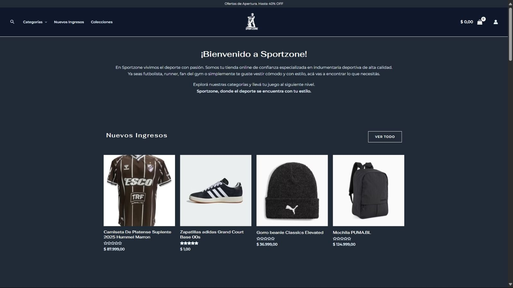
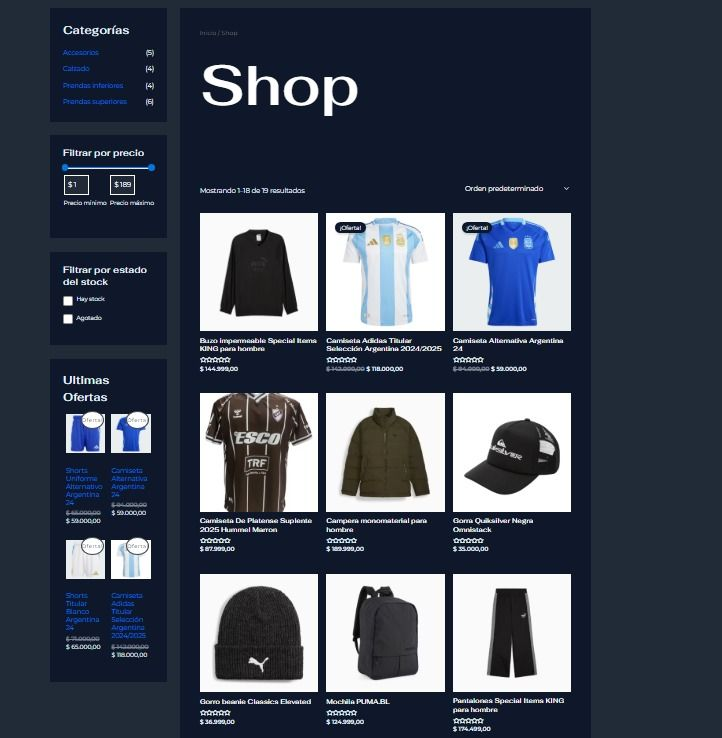
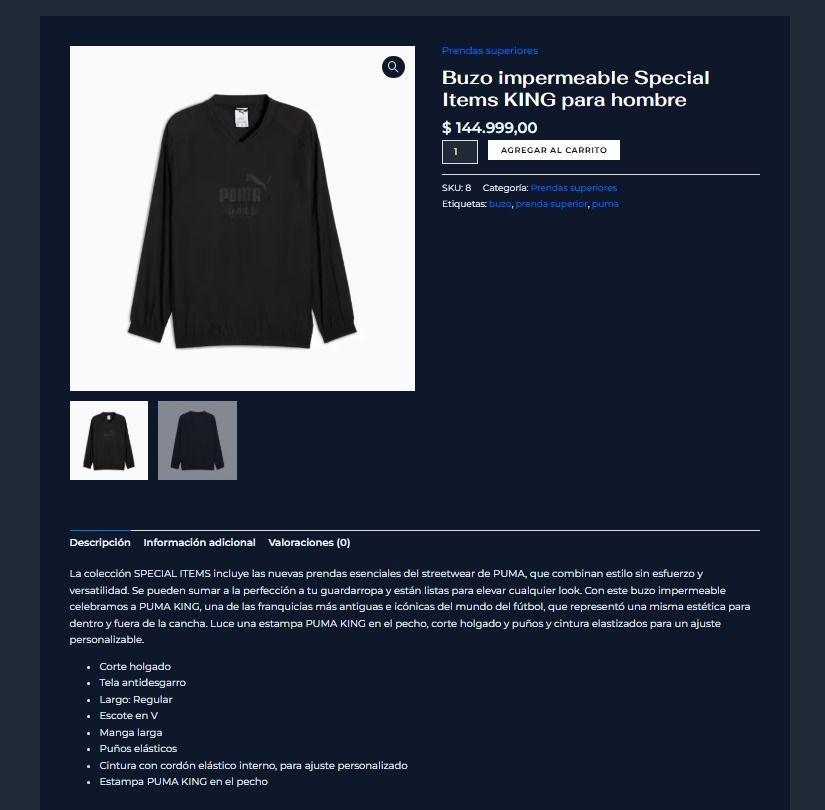

# SportZone – WordPress Website 🏀
**SportZone** is an academic project developed as a **sports web platform**, created with **WordPress** and based on the **Astra** theme. The website aims to deliver a modern, clean, and responsive experience for presenting content related to sports, health, and wellness.

---
## 🚀 Live Demo
🔗 [https://sport-zone.space](https://sport-zone.space)
---
## 🎯 Project Objective
The main goal was to build a functional, visually appealing, and easy-to-manage website for users without technical knowledge, leveraging the flexibility of the WordPress ecosystem.
My focus included:
- **Customization**: Adapting the structure and design of the Astra theme.
- **Branding**: Adapting the color palette, typography, and visual style to match the project’s identity.
- **Media**: Selecting and optimizing images and multimedia resources.
- **Navigation**: Configuring navigation, sections, and content categories.
---
## 🛠️ Technologies Used
- **WordPress** (CMS)
- **Astra Theme** (visual and structural base)
- **Elementor** and/or **Native Blocks** (visual composition)
- **HTML5 / CSS3** (custom adjustments)
- **Hostinger** (web hosting)
- **PHP 8.x** (WordPress runtime environment)
- **MySQL** (database)
---
## 📸 Website Screenshots
Below are some sections of the website:
### Home page

### Products section

### Product page

---
## 📚 Documentation
The following documents contain the formal planning, requirements, and risk analysis developed for this project:
- [📄 **Software Requirements Specification (SRS)**](docs/Especificación%20de%20Requerimientos%20de%20Software%20-%20SportZone.pdf)
  Detailed definition of the system's functional and non-functional requirements.
- [📄 **Software Development Plan**](docs/SportZone_Plan_de_Desarrollo_v1.0.pdf)
  Project planning, WBS, and effort estimations using FPA and COCOMO.
- [📄 **Risk List**](docs/Lista%20de%20Riesgos%20-%20SportZone.pdf)
  Identification and mitigation strategies for technical and project risks.
---
## 📬 Contact
For inquiries, collaborations, or support, feel free to reach out:
**Ignacio Leguizamon**  
Software Developer

---
> **Note**: This project was created for **academic and demonstrative** purposes. The **Astra** theme belongs to [Brainstorm Force](https://wpastra.com/) and is distributed under the GPL v2 license.

  

